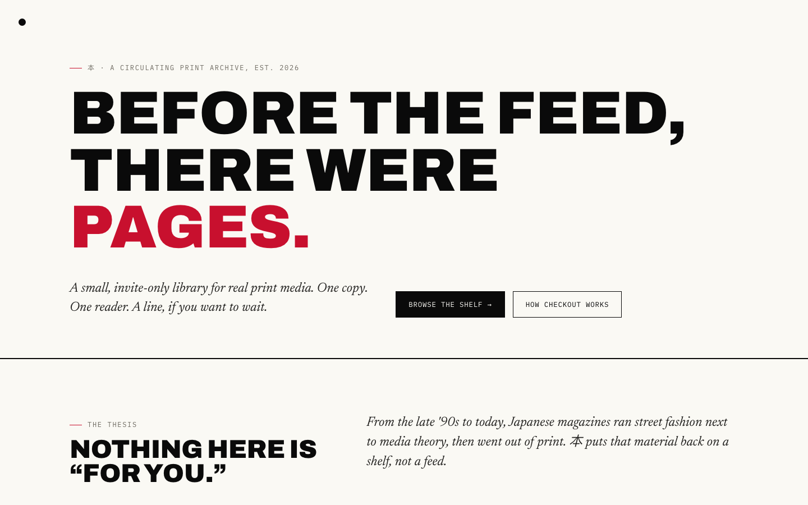

# 本 (hon)

**A small, invite-only library for real print media.** One copy. One reader. A line, if you want to wait.

[ho-n.com](https://ho-n.com) · [](https://github.com/matured/H-on/actions/workflows/test.yml)



## What this is

本 circulates real, physical Japanese magazines and books from 1998–2025 — one copy of each title, borrowed by one reader at a time, with a queue instead of infinite digital copies. It's the anti-feed answer to how media discovery usually works: nothing here is recommended to you, nothing is algorithmic, and membership works through library cards passed between people rather than an open sign-up.

- **The Archive** — a scattered, browsable shelf of the current catalog, sorted by genre and era.
- **Real circulation** — checkout, return, and queueing against a live backend, row-locked against overselling.
- **Invite-only membership** — join by redeeming a library card; every member gets five more cards to pass on.
- **Founder/admin tools** — issue cards, manage loans, and edit the catalog from a gated admin panel.

## Stack

Static HTML/CSS/vanilla JS — no build step, no framework. Real state lives in [Supabase](https://supabase.com) (Postgres + Row Level Security), loaded via a plain `<script>` tag. The only dev dependency is the test toolchain.

```
css/style.css        single shared stylesheet, all design tokens
js/circulation.js    checkout/return/queue + catalog fetch, against Supabase
js/browse.js         the Archive's scattered-shelf layout + filters
js/item.js           item detail page
js/main.js           site-wide nav + corner brand mark, injected on every page
supabase/migrations/ schema + RPCs
```

See [PROJECT_NOTES.md](PROJECT_NOTES.md) for the full architecture history and design decisions.

## Running it locally

No build step — open any `.html` file directly, or serve the folder for more reliable `localStorage`/fetch behavior:

```bash
python3 -m http.server 4173
```

## Testing

```bash
bun install
bun run test       # Vitest unit tests
bun run test:e2e   # Playwright end-to-end tests
```

Both suites run in CI on every push and pull request.

## Contributing

This is a personal project — issues and PRs are welcome, but there's no formal contribution process. `main` is protected: changes land through a pull request with passing tests.
